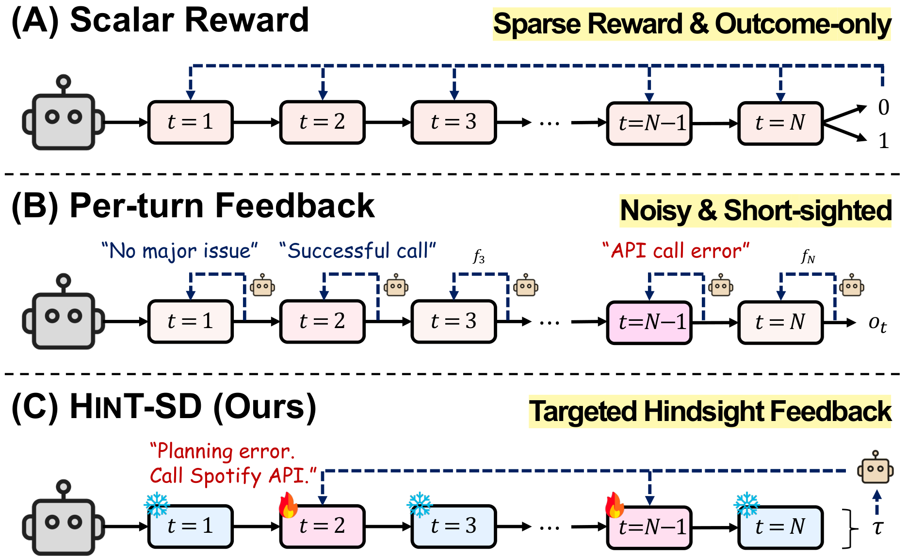

# HINT-SD: Targeted Hindsight Self-Distillation for Long-Horizon Agents

[](https://arxiv.org/abs/2605.17873)
[](https://www.python.org/downloads/release/python-3130/)

**HINT-SD** addresses **relevance sparsity** in long-horizon agents: only a few actions in a trajectory are relevant to its eventual failure. Scalar rewards do not indicate where or how to correct the agent, while per-turn feedback can introduce noisy supervision and overlook earlier decisions behind delayed failures. HINT-SD uses full-trajectory hindsight to identify these actions, generate corrective feedback, and distill a feedback-conditioned teacher only on the selected action tokens. Even without a stronger teacher model or significant additional compute, HINT-SD improves both agent performance and training efficiency **with only self-generated feedback**.

<p align="center">
  
</p>

---

## 🚀 Get Started

We recommend using [uv](https://docs.astral.sh/uv/) to set up the environment. Dependencies are specified in `pyproject.toml` and pinned in `uv.lock`. Benchmark dependencies are installed in separate environments using the setup scripts described below.

### 1. Clone the Repository

```sh
git clone https://github.com/wgcyeo/HINT-SD.git
cd HINT-SD
```

### 2. Install Dependencies & Set Up Datasets

After [installing uv](https://docs.astral.sh/uv/getting-started/installation/), run:

```bash
uv sync
cp .env.example .env
```

For W&B logging, set `WANDB_PROJECT` in `.env` and run `uv run wandb login`. To disable logging, set `REPORT_TO=none` in `.env`.

Run the setup script for your dataset to install dependencies and prepare `data/<backend>/{train,eval,test}.jsonl`:

```bash
bash scripts/setup_bfcl.sh      # BFCL
bash scripts/setup_appworld.sh  # AppWorld
```

### 3. Start the Environment Server

Keep the matching server running in a separate terminal during training and evaluation:

```bash
bash env/service/launch_script/bfcl.sh      # BFCL: localhost:8080
bash env/service/launch_script/appworld.sh  # AppWorld: localhost:18080
```

## 🏋️ Training

Train HINT-SD with:

```bash
bash scripts/train.sh <MODEL_NAME> --backend <DATASET_NAME>
```

Use `--backend appworld` for AppWorld and `--backend bfcl` for BFCL. Replace `<MODEL_NAME>` with a Hugging Face model ID or a local model directory. The default model is `Qwen/Qwen3-4B-Instruct-2507`.

### Options

```text
--variant single|multi         # Hindsight targets: one or up to three (default: multi)
--max-env-steps <n>            # Actions per rollout (default: BFCL: 20; AppWorld: 40)
```

Checkpoints are saved to `outputs/<model>-<backend>-hint-sd-<variant>/`. Run `bash scripts/train.sh --help` for all options.

## 📊 Evaluation

Evaluate a base model, LoRA adapter, or checkpoint with:

```bash
bash scripts/eval.sh <MODEL_OR_PATH> --backend <DATASET_NAME>
```

Replace `<MODEL_OR_PATH>` with a model ID or the path to a trained adapter directory, such as `outputs/<run_name>`. As in training, use `--backend appworld` for AppWorld and `--backend bfcl` for BFCL.

## 📖 Citation

```bibtex
@article{yeo2026hintsd,
  title={HINT-SD: Targeted Hindsight Self-Distillation for Long-Horizon Agents},
  author={Yeo, Woongyeong and Choi, Yumin and Ki, Taekyung and Hwang, Sung Ju},
  journal={arXiv preprint arXiv:2605.17873},
  year={2026}
}
```

## 🙏 Acknowledgements

The environment service is adapted from [AgentEvolver](https://github.com/modelscope/AgentEvolver). We thank all the maintainers of open-source projects and developers of open-weight models whose work helps advance this field!
